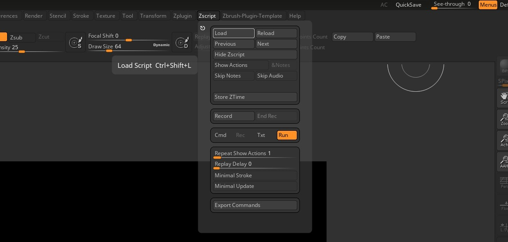
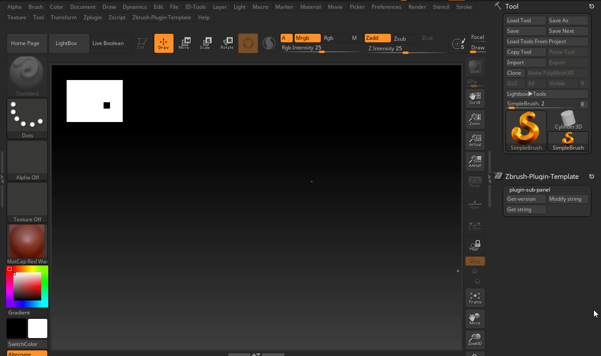

# Template for Zbrush plug-in development


**Links**
- Zbrush documentation - [Zscript - ZFileUtils](https://docs.pixologic.com/user-guide/customizing-zbrush/zscripting/zfileutils/)
- Rust FFI - [The Rust FFI ](https://doc.rust-lang.org/nomicon/ffi.html)

<br />
<div align="center">
    <div >
        
    </div>
</div>


<br />
<div align="center">

## ENTER

</div>

Having created my first ZBrush plugin, I'm excited to share my experience and knowledge with you. I hope this will help you understand the process of creating your own plugin.

The plugin is developed using **ZScript**, a scripting language similar to LISP, for the user interface and communication with ZBrush. Additionally, Rust is used to create dynamic link libraries (dylibs) for the plugin's core functionality. This plugin template provides a basic structure for ZBrush plugin development, encompassing both the ZScript side for UI and interaction, and the Rust dylib for handling the plugin's logic.

Our aim is to create a dynamic library (dylib) compatible with C, allowing it to be seamlessly integrated as a shared library within ZScript. This will ultimately extend the capabilities of ZBrush by providing additional functionalities.

**Our development strategy involves three key steps:**
1. **Implement the ZScript plugin template:** This provides the foundation for our plugin's functionality within ZBrush.
2. **Develop the Rust dynamic library (dylib) with C compatibility:** This core component will handle the plugin's essential logic.
3. **Integrate ZScript logic to call the Rust dylib:** This step establishes communication between the user interface and the core functionalities, enabling the plugin to operate effectively.

<br />

<div align="center">


## Implement the template of ZScript plugin 

</div>

### Base structure

On the ZBrush side, we'll implement the plugin template, which will serve as the user interface (GUI). This interface will consist of several buttons for user interaction:

- `Get Version` 
- `Get String` 
- `Modify string` 

Each button will contain essential ZScript code designed to call our Rust dylib. Once the dylib executes, the results will be passed back to ZBrush for further processing.

<br />

### Specify plugin name 
First of all we have to create `.txt` file, lets call it as `zbrush_plugin.txt` and define the first variables which we will use across our code.


> *I'll use specific guide marks in my code snippets, denoted by comments like // zbrush_plugin.txt. These comments indicate the file where the code should be added, following the order from top to bottom within that file. Consider them as helpful pointers for understanding the code structure.*

```rust
// zbrush_plugin.txt

/* Define plugin name which used for DLL path as well */
[VarSet, pluginName, "Zbrush-Plugin-Template"]
```


Check Zbrush version

```rust
// zbrush_plugin.txt

/*Set variable with the Zbrush version. [ZBrushInfo,0] - standard function which return the Zbrush version */
[VarSet, zbrushVersion, [ZBrushInfo,0]] 
```

<br />

### If  Statement for  DLL assignment
With if statement we can check operating system and depend of platform assign the path to the Rust dylib. Windows uses `.dll` and MacOS `.dylib` 

**IMPORTANT NOTES**  
 - On MacOS we have to load dylib only from `ZBRUSH_ZSTURTUP/ZPlugs64` directory. If we load dylib from other directory Zbrush returns error `Could not find path to dylib`.
- On MacOS defined name of variables `im_variable` wont work and produce error: `insufficient input` use instead `imVariable`.

<br />

**MacOS and DLL Path** - I spent considerable time troubleshooting a DLL path issue specific to macOS while using ZBrush. Initially, I suspected an error in my Rust-written dylib or incorrect C-like dylib implementation. However, debugging on Windows revealed that absolute paths for DLLs worked regardless of location, indicating a macOS-specific limitation within ZBrush.

> *I've tried communicate with Pixologic support, but they didn't provide help with this specific question.* - nothing to say here ¯\_(ツ)_/¯ 

<br />
<div align="center" >
    <div>
        
    </div>
</div>

<br /><br />
Okay let's back to our if statement. First of all we need define variable which is include information about operation system we use:

```rust
// zbrush_plugin.txt
[VarSet, isMacOS, [ZBrushInfo, 6]]
```

<br />

Where `[ZbrushInfo, 6]` with parameter `6` return type os operation system. Then we need define if_statement 
```rust 
// zbrush_plugin.txt

[If, isMacOs,
```
which is means returned value grater then `0` is `true` and we using `MacOS`, if returned value equal to `0` means we using `Win`. In body statement we difine variable which is contain path to out DLL file depend of condition. 

<br />

**For macOS we include path on .dylib file:**
```rust
// zbrush_plugin.txt

[VarSet, dllPath, 
    [StrMerge, "ZBRUSH_ZSTARTUP/ZPlugs64/", pluginName, "/zbrush_rlib.dylib"]
]
```

<br />

**For WindowsOS path on .dll file:**
```rust
// zbrush_plugin.txt

[VarSet, dllPath, 
    [StrMerge, "ZBRUSH_ZSTARTUP/ZPlugs64/", pluginName, "/zbrush_rlib.dll"]
] 
```
In the end we can use one dynamic variable `dllPath` across our code when we need get access to our external library writen on rust. **Long story short** if you run your plugin on MacOs it will use `.dylib` on windows `.dll` that's it.


<br />

**Pay attention how constructed if statement in Zscript** - *all punctuation symbols have meter.*
```rust
// Statement begin
[If, 1, // 1 is true 0 is false
    [VarSet, foo, "Hello World"] // return if true
    , // <= , means else statement
    [VarSet, foo, "Buy!"] // return is flase
]
```

<br />

**Full if-statement snippet:**
```rust
// zbrush_plugin.txt

[VarSet, isMacOS, [ZBrushInfo, 6]]
[If, isMacOS,
    // For macOS we include path on .dylib file:
    [VarSet, dllPath, 
        [StrMerge, "ZBRUSH_ZSTARTUP/ZPlugs64/", pluginName, "/zbrush_rlib.dylib"]
    ]
    , // <= , means else statement
    // For WindowsOS path on .dll file:
    [VarSet, dllPath, 
        [StrMerge, "ZBRUSH_ZSTARTUP/ZPlugs64/", pluginName, "/zbrush_rlib.dll"]
    ] 
]
```
Next step to define our **Plug-in Panel** ( in zbrush context called Pallete) which is part of zbrush UI ( User Interface ). So first step is declare panel with own name.

We can do it with `IPalette` function. This function is responsible for creating a new palette in ZBrush. The first parameter is the `name` of the palette, the second parameter is the `number of buttons` in the palette, and the third parameter is the `hotkey` for the palette. The hotkey is a combination of keys that will open the palette. In this case, the hotkey is `Alt+Shift+K`. 

```rust
// zbrush_plugin.txt

/* Define Zbrush pallete */
[IPalette, pluginName,1, 1387] // Alt+Shift+K - assign hotkey to the palette
```

<br />

**How to Get the ID of Our Hotkey Sequence?**

ZBrush has its own logic for determining hotkeys, and they are represented as numeric IDs. To get the ID of your custom shortcut, follow these steps:

1. Assign your own shortcut to any button or to a newly defined button in your plugin. (Press and hold CTRL + ALT, then click on the interface item you want to assign a hotkey to. This could be a button, a slider, or a palette. Next, press the key on your keyboard that you want to assign to the interface item, or press ESC to exit.)

2. Save your hotkeys into a file. This file will contain all assigned shortcuts in ZBrush, including the new ones you defined! That's all—no magic (though it can be a bit confusing). You can then use the retrieved ID in your ZScript, for example: `[PREFERENCES:LIGHTBOX:LIGHTBOX,1387]`

```rust
//ZBrush Hotkeys
[BRUSH:MORE ITEMS,98] // B
[BRUSH:STANDARD,5447796] // Popup+T

// OUR KEY SEQUENCE
[PREFERENCES:LIGHTBOX:LIGHTBOX,1387] // Alt+Shift+K
```
<br />

After declaring our panel, we can add several buttons to it. These buttons can be further categorized into sub-categories, each containing additional buttons.
 - The ISubPalette function allows you to create sub-palettes within your ZBrush interface. It takes two arguments:
   - `name`: This defines the name displayed for the sub-palette.
   - `palette number`: This assigns a unique identifier to the sub-palette, used by other ZScript functions to reference it.
 - We can create buttons using the IButton function. In our case, we'll only be using the name parameter to define the button's label. Refer to the ZBrush documentation for information on other available parameters.

<br />

```rust
// zbrush_plugin.txt

// Sub palette
[ISubPalette, [StrMerge, pluginName,":", "plugin-sub-panel"  ], 0] // Sub-panel

// Button which will return result of our Rust dylib function `get_version`
[IButton, [StrMerge, pluginName,":", "plugin-sub-panel:Get-version"  ], "Get plugin version",
	// Body
] 

// Button which will return result of our Rust dylib function `get_string`
[IButton, [StrMerge, pluginName,":", "plugin-sub-panel:Modify string"], "This button will modify string on the plugin side",
	// Body
]

// Button which will return result of our Rust dylib function `get_string`
[IButton, [StrMerge, pluginName,":", "plugin-sub-panel:Get string"], "This button will get string from the plugin side",
	// Body
]
```

<br />


<div align="center" > 

*Zbrush palette will look like this* 

</div>

<br />

With our buttons defined, we can now add logic to them. In this case, our goal is to call the Rust dylib and display the results. To achieve this, we'll utilize the ZScript function FileExecute to execute the relevant function from the Rust library.
FileExecute function expect `6` parameters `4` of them is *function arguments* for our Rust function.
1. Path to the dylib file
2. Function name which we want to call
3. String parameter which we want to pass to the function
4. Integer parameter which we want to pass to the function
5. Input memory block. We can define memory block on zbrush side and pass it to the function. After function return result we can read it from this memory block. ( working as expexted for me) 
6. Output memory block which already contain data from zbrush, we can use it to pass data to the function. ( from my experience it's not working form me and every time just crush the Zbrush, so i don't use it)

As you might know, our Rust function expects four positional arguments, with each having a specific order defined by ZBrush. While all arguments should be implemented, you can mark them as optional if not used in your specific case. For instance, let's consider calling a Rust function that only requires the "Input memory block" argument. This argument must be provided in the fourth position, adhering to ZBrush's strict argument order.

In this case we can call it from Zscript in this way:

```rust
[FileExecute, [Var, dllPath], "get_string", , , inputMemory]
```

<br />

When we pass `dll` path into `FileExecute` and call our function `get_string` we have to pass `output_memory` block into it. And what is happened if we pass it in next way?
```rust
[FileExecute, [Var, dllPath], "get_string", inputMemory]
```

<br />

Correct **Zbrush** will return error and most likely will `crush` as we will try sorting memory block as string ( because zbrush required input string as first argument ) on rust side. So be careful with it.

To solve this problem we have to pass empty argument `,,` which is mean we don't pass any data into function. So if we have to pass first, second and third arguments as empty we just can separate it with commas `, , ,` each comma mean empty argument and then we can pass our `inputMemory` block as 4th argument.
```rust
[FileExecute, [Var, dllPath], "get_string", , , inputMemory]
```

<br />

The first button **Get plugin version** - is responsible for calling the `get_version` function from the Rust dylib.

```rust
// zbrush_plugin.txt

[IButton, [StrMerge, pluginName,":", "plugin-sub-panel:Get-version"  ], "Get plugin version",
	[VarSet, err, [FileExecute, dllPath, "get_version"]]
    [If, err,
        [Note, [StrMerge, "This DLL is version: ", err]]
        ,
        [Note, [StrMerge, "Error code: ", err]]
    ]
]
```

<br />

The second button **Modify string** - is responsible for calling the `get_string` function from the Rust dylib. 

If we want get some string data from Zbrush we need pass string as first argument into our Rust function. In our case we have to pass `pluginString` as first argument. And then i'm sure we expect to return back some result from Rust function. To do that we have to use `inputMemory` block. First of all we have to define it with `MemCreate` function. This function expect 3 parameters:
1. Name of the memory block
2. Size of the memory block in bytes. ( size is mean how many bytes we want allocate for our memory block and we have to be sure that it's enough to store our result)
1. Value which we want to fill our memory block. ( in our case it's 0)

Okay as we defined our memory block we can pass it into our Rust function as 3th positional argument ( second and third argumens we not using, that mean we can use `string, , , inputMemory` to pass it as empty) and after that we can read result from it with `MemReadString` function. 

This function expect 2 parameters:
1. Name of the memory block
1. Name of the variable which will store result from memory block.

And as we have result in our variable we can display it with `Note` function. 

<br />

Finally, we need to deallocate the memory block using the `MemDelete` function. This function takes a single argument: the name of the memory block you want to delete.

As you've likely observed, this function expects a string as its first argument. We process this string within the function, making any necessary modifications, and then return the modified string back to ZBrush, storing it in the provided memory block.

This is basic logic how we can pass data from Zbrush to Rust and then return it back to Zbrush.

** IMPOERTANT NOTE:** ZScript variables operate within a global scope, meaning they are accessible throughout your script from top to bottom. To prevent conflicts and unexpected behavior, ensure you assign unique names to your memory blocks.

```rust
// zbrush_plugin.txt

[IButton, [StrMerge, pluginName,":", "plugin-sub-panel:Modify string"], "This button will modify string on the plugin side",
    [VarDef, pluginString, "I'm string from Z-Script"]
    [MemCreate, outputMemoryModify, 1024, 0] // Allocate a buffer for the output
	[VarSet, ptr, [FileExecute, [Var, dllPath], "modify_string", pluginString, , outputMemoryModify]]
    [VarDef, modifiedString, ""]
    [MemReadString, outputMemoryModify, #modifiedString]
    [Note, modifiedString]
    [MemDelete, outputMemoryModify]
]
```
The third button **Get string** - is responsible for calling the `get_string` function from the Rust dylib. 

I'll skip detailed explanation here as this button functions similarly to the second one, with a key distinction: it only requires a memory block as input and returns a unique result directly from the Rust function.

Now you can imagine that you can get any information from plugin side in this way. 

```rust
// zbrush_plugin.txt

[IButton, [StrMerge, pluginName,":", "plugin-sub-panel:Get string"], "This button will get string from the plugin side",
    [MemCreate, output_memory, 1024, 0] // Allocate a buffer for the output
	[VarSet, ptr, [FileExecute, [Var, dllPath], "get_string", , , outputMemory]]
    [VarDef, returnedString, ""]
    [MemReadString, outputMemory, #returnedString]
    [Note, returnedString]
    [MemDelete, outputMemory]
]
```
In general, this is the basic structure of the ZScript plugin. We have a palette with buttons, and each button calls a function from the Rust dylib. Nothing complicated so far. In the next section, we will implement the Rust dylib with C compablities.

<br />
<div align="center">

## Rust DLL with libc compablities

</div>

First of all we have to create new Rust library project. We can do it with `cargo` command:
```bash
cargo new --lib zbrush_rlib
```
This command will create new library project with name `zbrush_rlib`. After that we have to setup our `Cargo.toml` file and set all dependencies which we need to use in our project.

Next we have to set name of our compiled library. We can do it with `name = "zbrush_rlib"` parameter in `[lib]` category.

Then add `crate-type = ["cdylib"]` to our `Cargo.toml` file. This is mean we want to create dynamic library with C compablities.

And finaly we have to add `winapi` crate - which is include all necessary types and functions to work with Windows API.   

```toml
[package]
name = "zbrush_rlib"
version = "0.1.0"
edition = "2021"

[lib]
name = "zbrush_rlib"
crate-type = ["cdylib"]

[target.'cfg(windows)'.dependencies]
winapi = "0.3"

```

On rust side to implement our function with C compabilities i will use next modules:

To manage memory blocks we can use `std::ptr` module. This module is include all necessary functions to work with memory blocks.
```rust
// lib.rs
use std::ptr; 
```
To work with strings we can use `std::ffi` module. This module is include all necessary functions to work with strings. In our case we will use `CString` and `CStr` types to convert string from Rust to C and vice versa.
```rust
// lib.rs
use std::ffi::{CStr, CString}; 
```

To manage types with C compabilities we can use `std::os::raw` module. This module is include all necessary types to work with C. In our case we will use `c_char`, `c_double`, `c_float`, `c_int` types to work with strings, integers and floats.
```rust
// lib.rs
use std::os::raw::{c_char, c_double, c_float, c_int};
```
Okay we have all necessary modules to work with C compabilities. Now we can implement our function which is `get_version`. This function will return version of our plugin.

Firs we need understand waht function signature Zbrush is expexted. Based on ZScript documentation `[FileExecute]` exepect next parameters:
```rust
[FileExecute,
    File name including the extension (such as plugin.dll ).,
    Routine to call., // Name of the function which we want to call
    Optional text input., // Optional string input.
    Optional number input., // Optional float number input. Can be size of memory block
    Optional memory block input., // Optional memory block input.
    Optional memory block output. // Optional memory block output. ( doesn't work for me crashes Zbrush. but we can use memory input block instead)
]

// Executes the specified plugin file (DLL).
// Output: Returns the result value which was returned by the executed routine. Returns zero if error
```
Based on this information we can define our function signature in Rust:
    
```rust
// lib.rs
#[no_mangle]
pub extern "C" fn get_version(
        _optional_text_input: *const c_char, 
        _optional_number_input: c_double, // float number
        _input_memory_block: *mut c_char, 
        _output_memory_block: *mut c_char ) -> c_float {

    let version = 5i32;

    version as c_float
}
```
Let's quickly go through the function... 

First important thing here is `#[no_mangle]` attribute. This attribute is used to disable name mangling. 

Name mangling is a technique used to give each function in a program a unique name. This is necessary because the same function name can be used in different parts of the program. 

The #[no_mangle] attribute is used to disable name mangling and ensure that the function name is not changed by the compiler. This is necessary because we want to call this function from ZScript, and ZScript expects the function name to be exactly as we defined it.

Then we define our function as public with `pub` that mean we can call it from outside of our library. `extern "C"` mean we want to use C compabilities in our function. 

Then we define our function name `get_version` and list of arguments and return type -> `c_float`.

All arguments and their positions is strictly defined by Zbrush and we have to follow this in our function. As you already noticed we using the same arguments as we defined in ZScript:
- `_optional_text_input: *const c_char` - is mean we can pass string into our function.
- `_optional_number_input: c_double` - is mean we can pass float number into our function.
- `_input_memory_block: *mut c_char` - is mean we can pass memory block into our function. ( Im not using it, as i mentioned before it's not working for me)
- `_output_memory_block: *mut c_char` - is mean we can pass memory block into our function.

In body of our function we define variable `version` with value `5` and then we return it as `c_float`. This value will return to Zbrush and we call it from ZScript. 

*In Rust we can skip `return` keyword if it is the last line of the function withou semicolon `;` at the end of function, loop or if statement block without semicolon as well.*

Okay we just implemented our first super simple function with C compabilities. Which is return version of our plugin in moment when we call it from ZScript.

Let's quick implement our second function `get_string` and speak about important things in it.

```rust
#[no_mangle]
pub extern "C" fn get_string(
    _optional_text_input: *const c_char, 
    _optional_number_input: f64, // float number
    _input_memory_block: *mut c_char, 
    _output_memory_block: *mut c_char ) {

    let z_string = CString::new("I your string from external rust dylib").unwrap();
    let bytes = z_string.as_bytes_with_nul();

    unsafe {
        ptr::copy_nonoverlapping(bytes.as_ptr(), _input_memory_block as *mut u8, bytes.len());
    }
}
```

First difference here compared to our first function is that we don't return any value from our function. We just modify memory block which we passed into our function. But we still have to define all arguments as we defined in ZScript.

Then we define `z_string` with value `I your string from external rust dylib` and then we convert it to `bytes` with `as_bytes_with_nul` function. This function is used to convert a string to a byte array, including the null terminator what is equal to `CString` type. Shorts words about `CString` type - it's a type which is used to convert string to C string. 

Then we use `unsafe` block to copy our `bytes` into `_input_memory_block` memory block. `ptr::copy_nonoverlapping` function is used to copy the bytes from one memory location to another in our case write our string into **Zbrush** memory block.  `unsafe` block is more like analog of `C` language and it's used to bypass the Rust compiler's safety checks.

That all what we need to do if you want to modify memory block on Rust side and then pass new data back to Zbrush.

Okay we just implemented our second super simple function with C compabilities. Which is modify string in memory block in moment when we call it from ZScript.

Let's quick implement our third function `modify_string` and speak about important things in it.

```rust
#[no_mangle]
pub extern "C" fn modify_string(
    _optional_text_input: *const c_char, 
    _optional_number_input: c_double, // float number
    _input_memory_block: *mut c_char, 
    _output_memory_block: *mut c_char ) -> c_int {
    
    // Get data from _input_memory_block   
    let input_block = unsafe { CStr::from_ptr(_input_memory_block).to_str().unwrap() };
    // Get data from _optional_text_input
    let message_body = format!("I've recived you string and returned it back:\n{}", input_block);
    let c_string = CString::new(message_body.as_bytes()).unwrap();
 
    // Write data to the output memory block
    unsafe {
        ptr::copy_nonoverlapping(
            c_string.as_ptr(), 
            _input_memory_block, 
            c_string.as_bytes().len()
        );
    }
    0 // Success
}
```
First difference here compared to our second function is that we return value from our function. This value is used to indicate the success of the function. If the function returns `0`, it means the function was successful. If the function returns any other value, it means the function failed. Value can be assoiated with `error code` which helps to build logic of program.

The second difference we read data from `_optional_text_input`, modify it with `format!` macro and then write it back to `_input_memory_block`, which allow us return modified string back to Zbrush. That's all what we need to do if you want to modify string in memory block on Rust side and then pass new data back to Zbrush.

<br />
<div align="center">
	
## Rust compile
</div>

**Finally we can compile our library and pack all into Zbrush plugin.**

As we going to use our library on MacOS and Windows we have to compile it for both platforms, first example will be for **Windows** and it's very straightforward:
```bash
// Bash command
cargo build --release
```

**Rust compile for MacOS x86_x64**  *It's not cross-compilation, i've compiled it on MacOS.*

Mac os compile is a bit more complicated, because we have to compile our library for two architectures: x86_64 and arm64. This is necessary because Apple has transitioned from Intel processors to its own ARM-based processors. 

To compile your Rust library for both x86_64 and arm64 architectures, you need to set up a cross-compilation environment. Here's how you can do it:

1. Install the necessary target architectures for Rust. You can do this with the rustup command:
```bash
rustup target add x86_64-apple-darwin
rustup target add aarch64-apple-darwin
```
2. Install a linker for the x86_64 architecture. If you're on MacOS, you should already have the necessary linker installed.

3. Build your library for each architecture:
```bash
cargo build --release --target x86_64-apple-darwin
cargo build --release --target aarch64-apple-darwin
```
This will create two separate .dylib files, one for each architecture.

4. Use the lipo command to combine these two .dylib files into a single universal binary. The `lipo -create -output` command creates a new file that contains the binary code for both architectures:

```bash
lipo -create -output "zbrush_rlib.dylib" \
  "target/x86_64-apple-darwin/release/libzbrush_rlib.dylib" \
  "target/aarch64-apple-darwin/release/libzbrush_rlib.dylib"
```

After running these commands, your `zbrush_rlib.dylib` file should be a universal binary that works on both `x86_64` and `arm64` architectures.

<br />
<div align="center">
	
## Pack Zbrush plugin
</div>


When we got all necessary files we can pack it into Zbrush plugin. Structure does very simple and include one directory for dependecies ( in our case this is for our Rust dylib's files) and one file with ZScript.txt. During development for ZScript we are using `.txt` extention, but after first execution from `Zscript menu`, Zbrush will compile it to `.zsc` file. And that file we will use for distribution. Zbrush using `.zsc` to auto load our plugin during Zbrush startup. 

<br />

File structure:
```bash
build/
    Zbrush-Plugin-Template/
        ├─── zbrush_rlib.dll
        └─── zbrush_rlib.dylib
    └─── zbrush_plugin.txt

```
After all files collected we can copy them into `Zplugin64` directory. This is the directory where Zbrush is looking for plugins. 

<br />

Windows path:
```bash
C:\Program Files\Pixologic\ZBrush 2023\ZStartup\ZPlugs64
```

<br />

MacOS path:
```bash
/Applications/ZBrush 2023/ZStartup/ZPlugs64
```

<br />

And then load our plugin from Zbrush menu `Zscript` -> `Load` -> `Zplugin64` -> to compile our `zbrush_plugin.txt` into `zbrush_plugin.zsc` file. Don't forget to copy compiled `.zsc` file to your build directory for futher distribution.



<br />

As we can see our plugin is loaded and we can see ne Pallete on top of the Zbrush window. If we click on it we can see our buttons which we implemented in ZScript. Lets click on each of them and check how they work.



<br />


<div align="center">
    <div style="font-size: 24px">And that's it. We just created our first Zbrush plugin with Rust. </div>
    <br /><br />
    <div >
        
    </div>
</div>


<div align="center">

## Afterword

</div>

I hope this article will help you to understand how to create your own plugin for Zbrush. I tried to cover all the necessary steps which you'll need to create your own plugin from scratch. 

In that moment when i decided to create my own plugin, I didn't find any useful information. I did a lot of crash tests, read different very old ( oldest discussion was 19 year old ) discussions on forums. Tried to understand how to glue all this stuff together. And finaly structurised all my knowledge in this article. That was interesting experiance for me, as i didn't have any experience with Zbrush and ZScript before even with C compabilities in Rust. But as end result I hope this documentation will help you to save your time and avoid my mistakes.

Feel free to use this template for your own plugin and modify it as you need, and if you have any questions or suggestions, feel free to contact me. I will be happy to help you.

<br />

**If you feel that this article was useful for you, and you want say thanks to me, you can buy me a coffee. It will be very appreciated.**


<div align="center">
    <a href="https://www.buymeacoffee.com/Dmytrenkoihor" target="_blank">
        
    </a>
</div>
